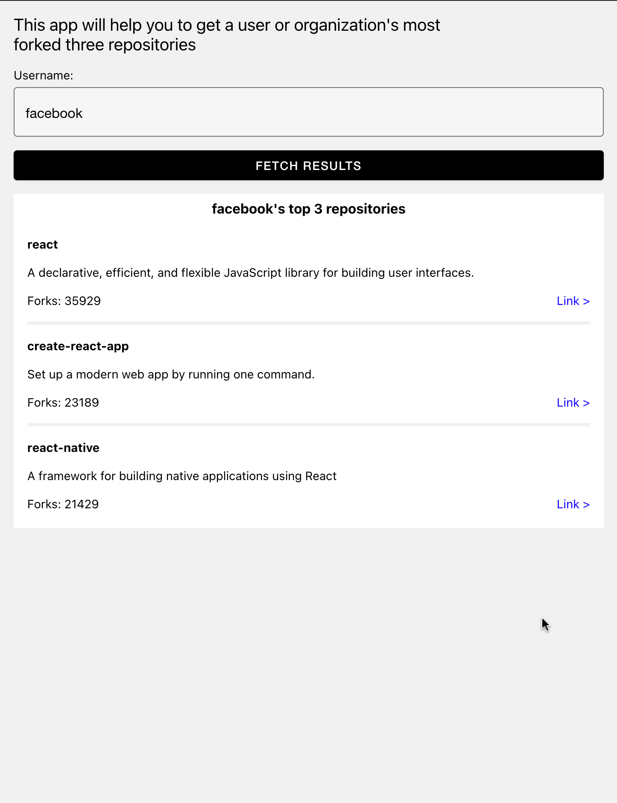

### It looks something like this:

- If you want to start this application the first step you need to take is to generate an AccessToken from Github. For this you can see [this GitHub page](https://docs.github.com/en/authentication/keeping-your-account-and-data-secure/creating-a-personal-access-token).

- After generating your token open [apollo.js file](apollo.js) and assign your token to `YOUR_ACCESS_TOKEN` variable.

- Now you are good to start testing. Have fun 👍
