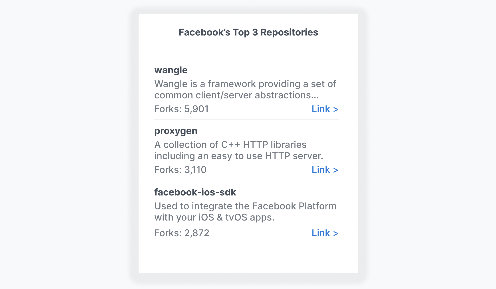

# AQS Frontend Coding Challenge

## Task

Use the Github GraphQL API to retrieve a user's repositories and display them using React Native.

---

Inside of this project is a simple `create-react-native-app` skeleton template with a semi-completed apollo client.

Please fork this repo and make all the necessary changes to complete the task to a 'production ready' standard.

The final product should list the top 3 most forked repositories for the user and display each repos fork count, description, title and href link.

Typically we expect applicants to spend around 30 minutes on this challenge and your submission will be graded entirely on code quality.

### It should look something like this:

## How to run

- Install with `yarn` or `npm install`.
- Run `npm run web` to start it in your browser.

## 📝 Notes

- The Apollo configuration lies in the `apollo.js` file.
- [Apollo Client Docs](https://www.apollographql.com/docs/react/v3.0-beta/)
- [Github GraphQL Docs](https://docs.github.com/en/graphql)
- [Github GraphQL Explorer](https://docs.github.com/en/graphql/overview/explorer)
